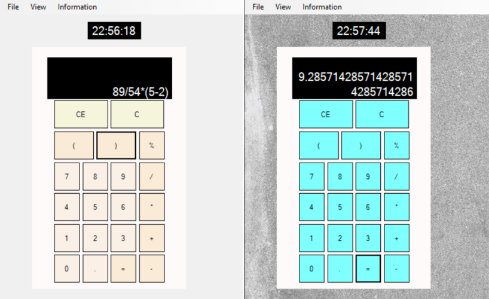

# Simple calculator with clock
## Table of contents
* [Description](#description)
* [Overview](#overview)
* [Technologies](#technologies)

## Description
This program is a calculator that allows you to perfom the following calculations:
-addition
-subtraction
-multiplication
-division
-modulo operations
It is also a digital clock that display the current time.
It is possible to enter characters using buttons or the keyboard.
The user can change the background image or buttons color.

## Overview

## Technologies
Project is created with Windows Forms C#.
